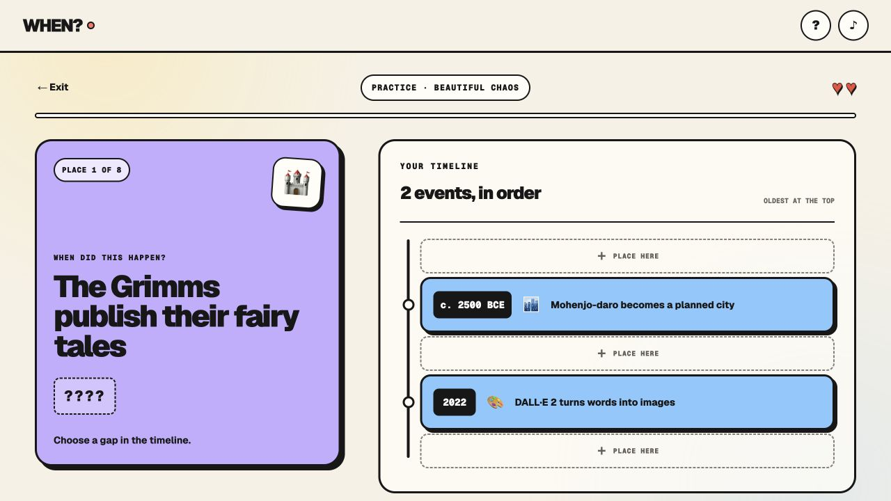

# WHEN?

**History has weird neighbors.** WHEN? is a playful daily timeline game about discovering which completely unrelated things existed at the same time.

**[Play the game →](https://playwhen.pages.dev)**



## The game

Place eight mystery events between two revealed anchors. You have two lives, every answer reveals the year, and each reveal includes a short fact that makes the collision worth remembering.

Everyone receives the same daily puzzle. Streaks and progress stay on the device, results can be shared without spoilers, and unlimited practice is available without an account.

## The library

The game contains 902 curated events and 1,321 fact reveals across technology, culture, discovery and world history. A 60-day cooldown keeps the daily rotation fresh, while five practice packs let players explore the full collection.

## Run locally

```bash
npm install
npm run dev
```

Open `http://localhost:3000`. Run `npm test` for linting, the 20-year daily-schedule audit and a production build.

Built with React, Next.js and Vinext for Cloudflare Workers.
